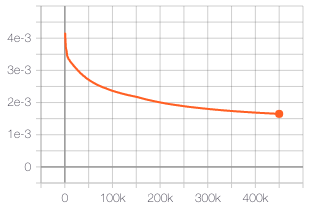
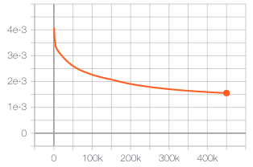
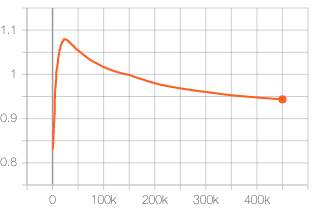
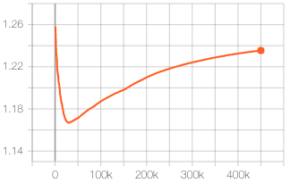
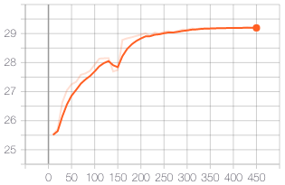

# DeepDeblur-PyTorch

This repository contains the **unofficial** PyTorch re-implementation of the paper: \
Deep Multi-scale Convolutional Neural Network for Dynamic Scene Deblurring \
Seungjun Nah, Tae Hyun Kim, Kyoung Mu Lee \
In CVPR 2017

[arXiv](https://arxiv.org/abs/1612.02177) | [Original Torch code](https://github.com/SeungjunNah/DeepDeblur_release)

**Note**: This code is for personal project. Details of the implementation may different from the original code. Should you be making use of this repository for your own research, please take it with care.

*Blurry image* | *Deblurred image* | *Sharp image* | 
:---: | :---: | :---: |
 |  |  |

## Performance

Performance on GOPRO test dataset (PSNR/SSIM)

*K* | *Original paper* | *This repository* 
:---: | :---: | :---: |
3 | 29.08dB / 0.9135 | 29.22dB / 0.8734*

\* Original paper used MATLAB implementation whereas this repo used skimage implementation. 

## Usage

### Installation

```bash
git clone https://github.com/jinsuyoo/DeepDeblur-PyTorch.git
cd DeepDeblur-PyTorch
```

### Requirements

- Linux (tested on Ubuntu 16.04 LTS)
- Anaconda
- Python 3.7
- PyTorch 1.5.0
- TensorFlow (used for Tensorboard visualization)

and the Python dependencies listed in `requirements.txt` file.

To install, please run the following commands.
```bash
conda create -n DeepDeblur python=3.7
conda activate DeepDeblur
conda install pytorch==1.5.0 torchvision==0.6.0 cudatoolkit=10.2.89 -c pytorch
pip install -r requirements.txt
```

### Prepare dataset

...

### Training model

```bash
python train.py
```

### Test model

```bash
python test.py
```

## Training logs

*Total G loss* | *Content loss* | *Adversarial loss* | *D loss* 
:---: | :---: | :---: | :---: |
 |  |  | 

*PSNR on validation set (same as test set in this research)* |
:---: |
 |

## Acknowledgments

Augmentation code borrows from the original code.